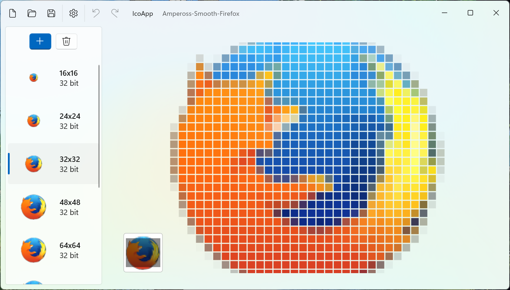

# IcoApp
IcoApp – a simple icon editor. Create icons from BMP/PNG files or extract images from existing icons.

[Download Pre-Release (Standalone)](https://github.com/albertakhmetov/IcoApp/releases/download/v0.1.0/IcoApp_v0.1.0.zip)

